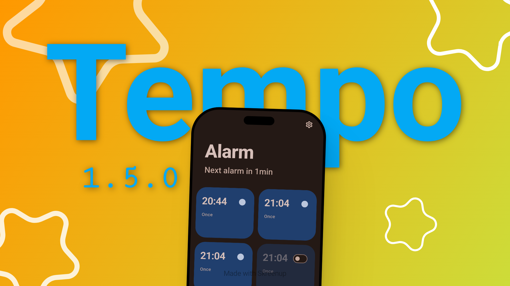

# Changelog

## [1.5.0] - 2026-06-03

> **⚠️ Early Release Notice**
> Tempo is still in active development. This is the first public release, and while the core features are functional, you may encounter bugs or rough edges. Your feedback is welcome — please report issues at the repository.
>
> The app is **under development** and will continue to improve with updates.

### What is Tempo?

Tempo is a minimalist, high-fidelity alarm clock app for Android, built with Flutter and Material 3 Expressive design. It focuses on clean typography, fluid animations, and a calm user experience.

### Features

- **Alarms** — Create, edit, and manage alarms with a beautiful 2‑column card grid. Set custom labels, repeat days, and notification sounds.
- **Container Transform animation** — Tap a card to expand it into the full-screen editor via a smooth M3 fade‑through transition.
- **Timer** — Countdown timer with H/M/S input, circular progress ring, and finish notification.
- **Stopwatch** — Lap recording with a custom orange‑ring progress indicator.
- **World Clock** — Search by city, save favorites, and view live times across time zones (offline via IANA database).
- **Sleep Timer** — Quick duration presets with a linear progress indicator.
- **Lock Screen** — When an alarm rings, a full‑screen lock screen shows the time with slide‑to‑snooze and slide‑to‑stop gestures.
- **Notification Controls** — Snooze (5 min) and Stop actions from the notification shade.
- **Material You Dynamic Colors** — The app adapts to your wallpaper‑derived colour palette automatically.
- **Light / Dark / System themes** — Toggle between light, dark, or follow your system setting.
- **In‑app Updates** — Choose between Stable and Beta update channels, check for new versions, and download APKs directly.
- **Onboarding flow** — A guided three‑page introduction on first launch.
- **Edge‑to‑edge design** — Full‑bleed immersive layout with transparent system bars.
- **Per‑ABI builds** — Optimised APK size with architecture‑specific split APKs (arm64‑v8a, armeabi‑v7a, x86‑64).

### Tech Stack

- **Flutter** with Dart
- **Material 3 Expressive** components + `animations` package for container transforms
- **Riverpod** for state management
- **Hive** for local persistence
- **flutter_local_notifications** for alarm scheduling and notifications
- **audioplayers** for alarm ring tones
- **timezone** for offline timezone database queries
- **connectivity_plus**, **url_launcher**, **package_info_plus**, **dynamic_color**
