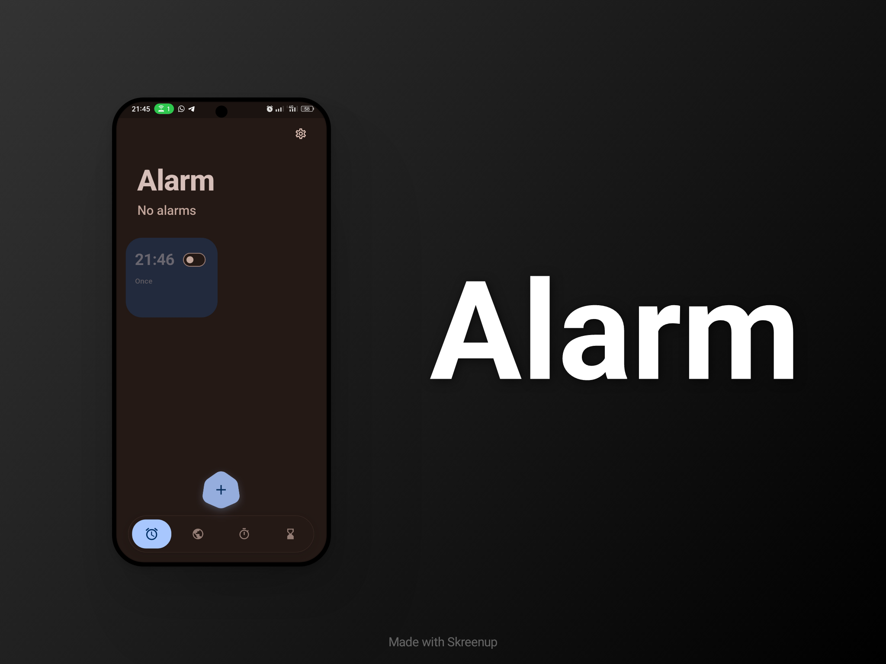
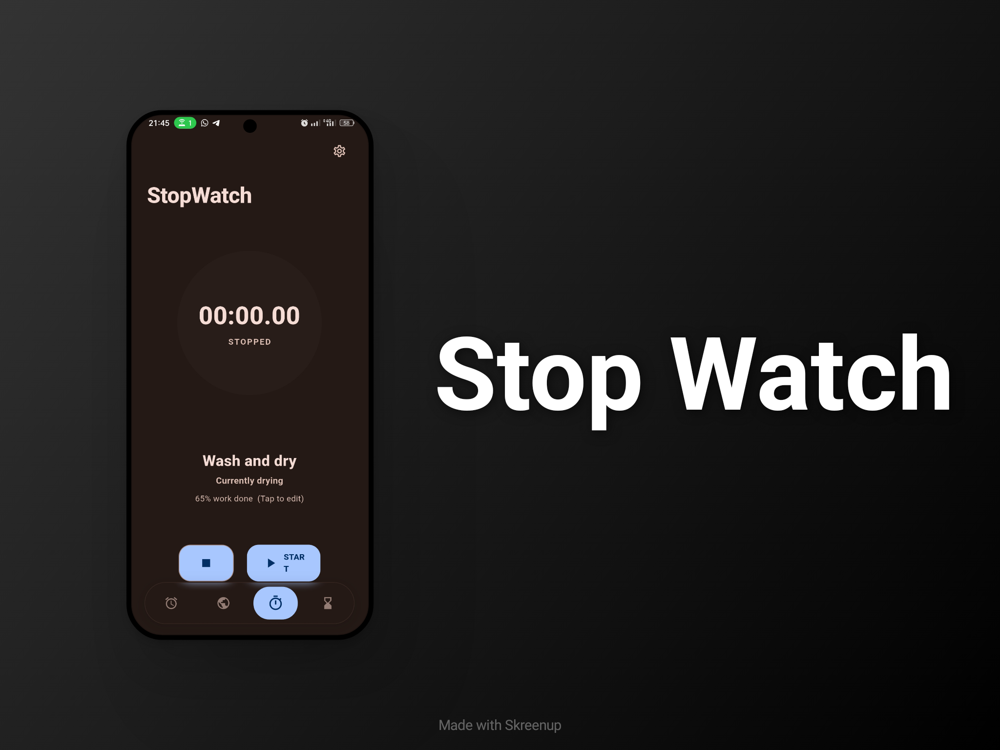
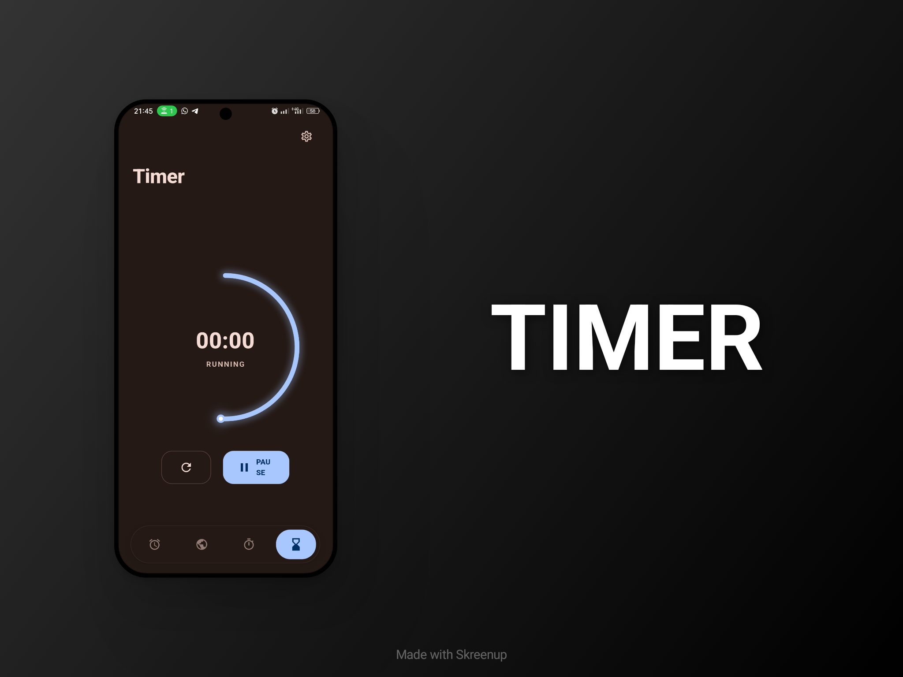
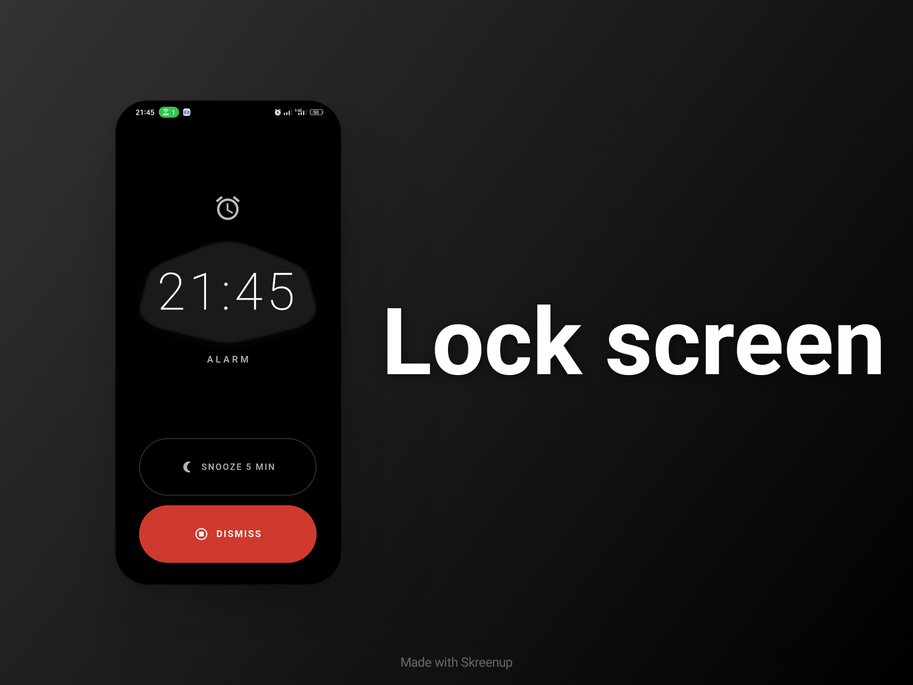

  <h1>Tempo</h1>
  
<em>a minimalist, high-fidelity alarm clock app</em>

  

    

  
  
  
  

---

## Features

- **Alarms** — 2‑column card grid with M3 Container Transform, swipe-to-delete, snooze/stop from lock screen or notification shade
- **Timer** — H/M/S countdown with circular progress and finish notification
- **Stopwatch** — Lap recording with orange-ring progress indication
- **World Clock** — City search, favorites, live offline timezone data
- **Sleep Timer** — Quick presets with linear progress
- **Lock Screen** — Full-screen alarm with slide-to-snooze/stop, auto-dismiss, vibrate, volume control
- **Material You** — Dynamic wallpaper-derived colors
- **Light / Dark / System** theme modes
- **In-app updates** — Stable & Beta channels, direct APK download

## Tech Stack

| | |
|---|---|
| **Framework** | Flutter 3.41+ / Dart 3.x |
| **State** | Riverpod |
| **Persistence** | Hive |
| **Notifications** | flutter_local_notifications |
| **Audio** | audioplayers |
| **Time Zones** | timezone |
| **Design** | Material 3 Expressive, animations package |
| **CI/CD** | GitHub Actions, R8 minification, AAB |

## About

| | |
|---|---|
| **Developer** | Mohamed |
| **Source** | [github.com/MoHamed-B-M/Tempo](https://github.com/MoHamed-B-M/Tempo) |
| **Version** | 1.5.0 |
| **License** | MIT |

> ⚠️ Tempo is in active development. You may encounter bugs — please [open an issue](https://github.com/MoHamed-B-M/Tempo/issues) if you find one.
